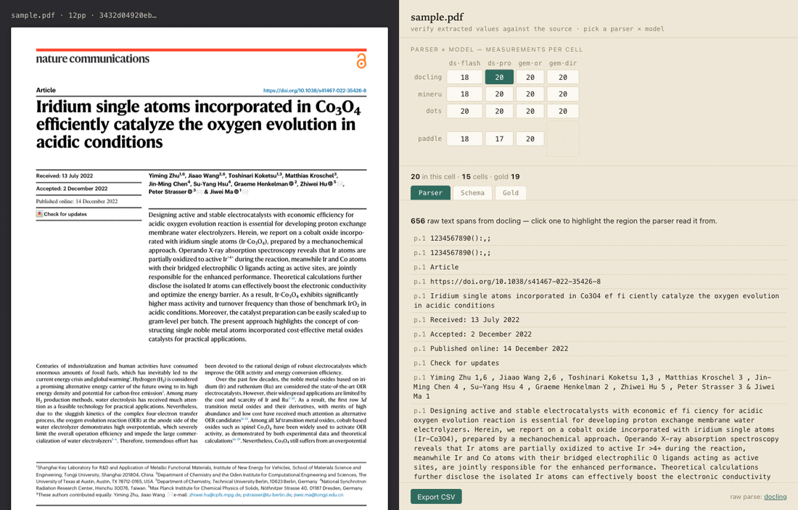
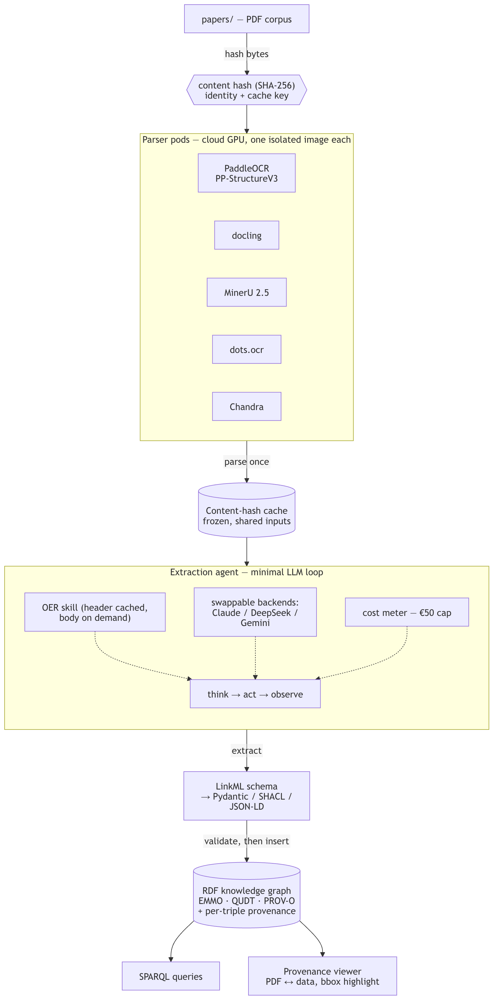
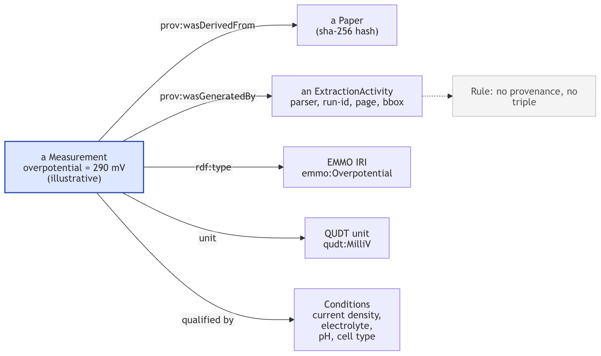
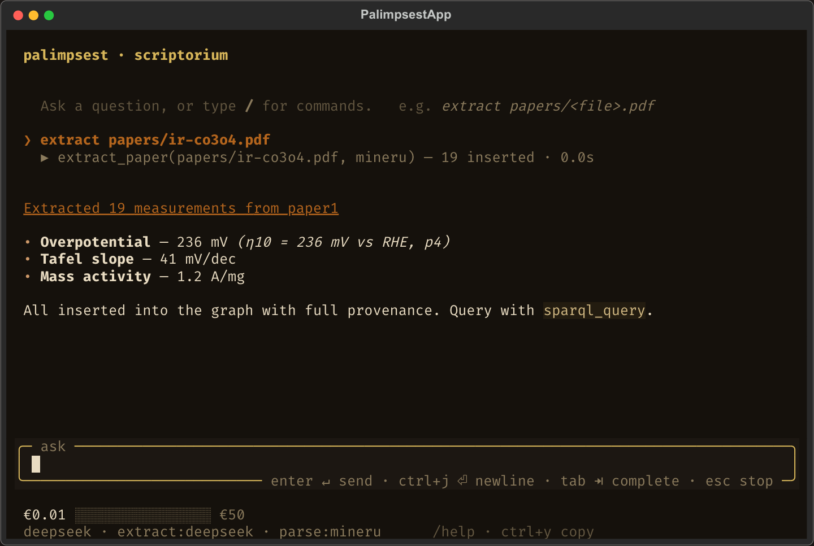
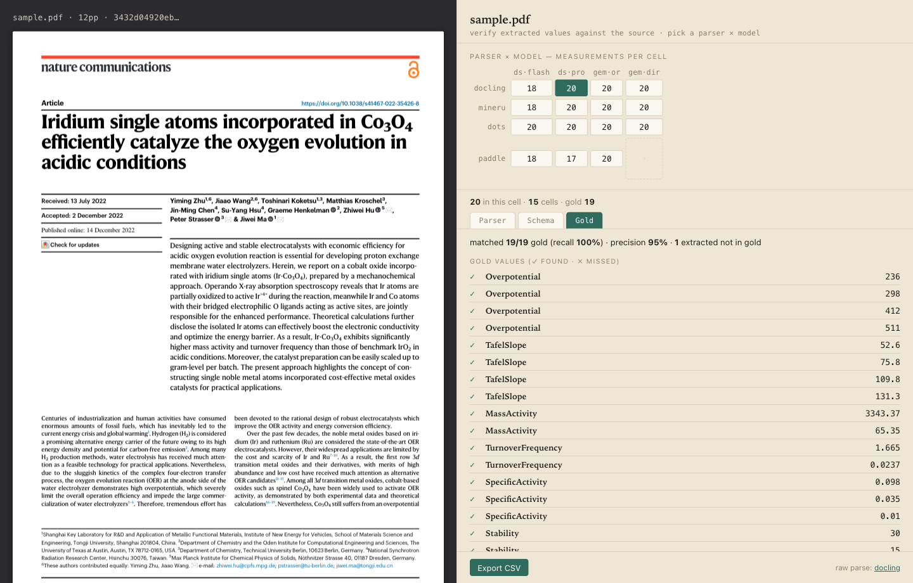
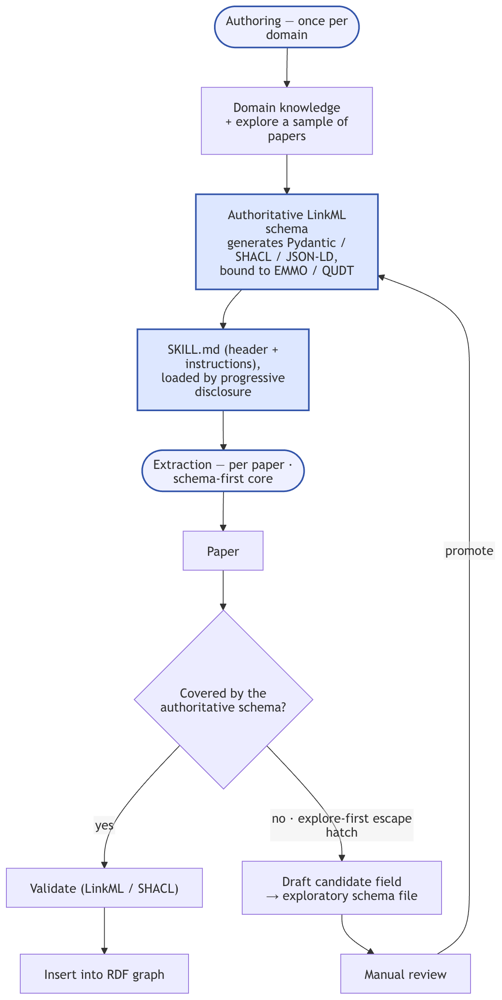

<h1 align="center">Palimpsest</h1>

<p align="center">
  <em>An autonomous research agent that turns scientific PDFs into a queryable,<br>
  provenance-tracked, ontology-aligned RDF knowledge graph - constrained by construction.</em>
</p>

<p align="center">
  
  
  
  
  
  
  
</p>

<p align="center">
  
</p>

---

Palimpsest is spawned in a workspace like a coding agent, but its job is research:
point it at a folder of PDFs and it parses them, extracts the quantities that
matter, and writes them into an RDF graph where **every single fact carries a
pointer back to the exact box on the page it came from**. You supervise from a
terminal UI; you verify in a side-by-side provenance viewer; you query the result
with SPARQL.

The demonstrator domain is **PEM-electrolyzer / oxygen-evolution (OER)
electrocatalysis** - overpotentials, Tafel slopes, stabilities - but the agent
itself is domain-general: new domains ship as `SKILL.md` folders, not new code.

> **Thesis contribution.** This is a 10-credit MSc mini-thesis at RWTH Aachen. The
> contribution is **the constrained-autonomy agent** - an autonomous LLM agent
> whose dangerous degrees of freedom are closed *in code*, not requested in a
> prompt. Parser-conditional extraction accuracy is one evaluation section, not
> the whole.

## Why it's different: constrained autonomy

An autonomous agent that can write files and run shell commands is useful and
dangerous. Palimpsest keeps the usefulness and removes the danger by enforcing
its invariants in code - the agent cannot reason its way around them:

| Invariant | How it's enforced | Where |
|---|---|---|
| **Writes stay in the workspace** | `write_file`/`edit_file` resolve `..`/symlinks and refuse anything outside the workspace root | `policy.py` |
| **Even `bash` can't escape** | every shell command runs under an OS sandbox (macOS Seatbelt / Linux bwrap); writes confined to the workspace, fail-closed | `sandbox.py` |
| **The graph is provenance-only** | triples enter the store **only** through the extraction pipeline, which attaches `(paper_hash, parser, page, bbox, run_id)` - no provenance, no insert | `pipeline.py`, `store.py` |
| **Spend has a hard ceiling** | a `CostMeter` is checked before every paid API call; €50 cap, refuses past it | `cost.py` |
| **Everything is reversible** | every mutating action is committed to a git repo *inside* the workspace (per-action checkpoints + per-turn tags), `/undo` restores | `versioning.py` |

The result is an agent you can let run: it acts freely inside a fenced playground,
and the things that would make autonomy reckless - clobbering the OS, fabricating
unprovenanced facts, blowing a budget, leaving an unauditable mess - are simply
not reachable.

## How it works

<p align="center">
  
</p>

```
PDF  ──parse──▶  cached markdown/layout  ──extract──▶  typed measurements
                 (5 cloud parsers,           (LLM, schema-validated)
                  parse-once by SHA-256)                │
                                                        ▼
   SPARQL / viewer / notebooks  ◀──  RDF graph  ◀──  provenance-stamped triples
                                     (pyoxigraph)      (paper, parser, page, bbox, run_id)
```

1. **Parse once, cache forever.** Five parsers - `docling`, `MinerU`, `Chandra`,
   `dots.ocr`, `PaddleOCR` - run on cloud GPUs (RunPod). Output is cached by the
   SHA-256 of the PDF bytes, so a paper is never re-parsed (and a parser is never
   re-billed). A cheap local path (`pymupdf4llm` + GROBID) handles quick lookups.
2. **Extract into a schema.** An LLM extracts typed quantities defined in a
   **LinkML** schema (`Overpotential`, `TafelSlope`, `Stability`,
   `PEMWECellVoltage`, …) aligned to EMMO ECHO + QUDT + PROV-O. Every value is
   validated before it's allowed near the graph.
3. **Insert with provenance.** Each measurement becomes RDF triples carrying the
   evidence that justifies them - the source paper, the parser that read it, the
   page, and the bounding box on that page.
4. **Query & verify.** Ask SPARQL questions, explore in agent-generated marimo
   notebooks, or open the **provenance viewer** and click any value to see it
   highlighted on the original PDF.

<p align="center">
  
</p>

## Two ways to drive it

**The agent TUI** (`pixi run tui`) - a Textual terminal UI: chat with the agent,
watch its tool calls stream live, track spend against the budget gauge, and use
slash commands (`/git` for the workspace action tree, `/review` for an agent-written
session summary, `/view` for the provenance viewer, `/use` to switch models,
`/cost`, `/issues`, `/undo`, `/budget`, themes). [Watch the demo](https://youtu.be/bWA27LkR4hQ).

<p align="center">
  
</p>

**The provenance viewer** (`pixi run viewer`) - a single-page FastAPI + PDF.js app
on `:8765` that renders the extracted graph against the source PDFs, so a human can
audit any number in seconds.

<p align="center">
  
</p>

## Extensible by file, not by code

New extraction domains (HER, CO₂RR, …) and new agent procedures are added as
`SKILL.md` folders - markdown with validated frontmatter - never by editing the
engine. The loader checks each skill's declared schema classes and tool names
against the live schema and tool registry, and quarantines (rather than crashes
on) a skill that references something that doesn't exist.

<p align="center">
  
</p>

Skills shipped today: `oer-extraction`, `pemwe-anode` (domain) and
`notebook-analysis`, `marimo-pairing`, `report-writing` (general).

## Quickstart

```bash
# 1. install the environment (Python 3.11, all deps) with pixi
pixi install

# 2. provide an LLM key - DeepSeek by default (cheap, Anthropic-wire compatible).
#    Export it, or just paste it when the TUI first prompts (it's saved to the
#    workspace .env, which is gitignored).
export DEEPSEEK_API_KEY=sk-...        # or ANTHROPIC_API_KEY for the Sonnet fallback

# 3. drop some PDFs in papers/ and launch the agent
pixi run tui

# 4. audit the result in the provenance viewer
pixi run viewer                       # http://localhost:8765

# run the test suite
pixi run test
```

Default runtime model is DeepSeek `deepseek-v4-flash` through DeepSeek's
Anthropic-compatible endpoint (cost); `AnthropicProvider` (Sonnet) is the fallback.
The extraction pass may additionally route through OpenRouter for model breadth.
The agent loop itself stays locked to the Anthropic wire format - no gateway drives
orchestration.

## Project layout

```
src/Palimpsest/        the engine
  agent.py             the agent loop (build_agent() - CLI + TUI share it)
  tools/               21 registered tools: bash, read/write/edit_file, search,
                       sparql_query, extract_paper, open_notebook, read_skill, …
  policy.py            workspace-confinement boundary (assert_writable)
  sandbox.py           OS sandbox for bash (Seatbelt / bwrap)
  pipeline.py store.py provenance-enforced RDF insertion (pyoxigraph)
  cost.py              the €-budget CostMeter (SQLite ledger)
  versioning.py        dulwich per-action checkpoints + /undo
  skills.py            SKILL.md loader + schema/tool validation
  tui/                 Textual terminal UI
  viewer/              FastAPI + vendored PDF.js provenance viewer
schema/                LinkML schema (EMMO ECHO + QUDT + PROV-O) + generated artifacts
skills/                SKILL.md folders (domain/ + general/)
experiments/           parser × model extraction-comparison harness
report/ thesis/        the written thesis + figures
tasks/                 task cards (the build log)
```

## Stack

Python 3.11 · pixi · Anthropic SDK (→ DeepSeek / Anthropic / OpenRouter) ·
pyoxigraph (RDF) · SQLite (cache + ledger) · dulwich (versioning) · LinkML (schema) ·
Textual + Rich + Typer (TUI) · FastAPI + PDF.js + HTMX (viewer) · marimo (notebooks).
No agent frameworks, no MCP servers, no vector DB - Python function calls and a
single hand-written agent loop.

## Status & scope

Active MSc mini-thesis (RWTH Aachen). The repository includes the engine, a working
TUI and viewer, the LinkML schema, the parser-comparison experiments, and the thesis
write-up in progress. Interfaces and schema are still evolving.

## License

[MIT](LICENSE) © 2026 Rahat Rakibuzzaman
