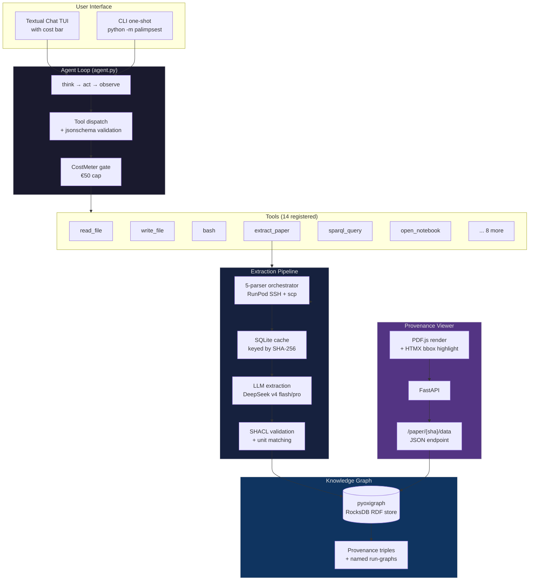

<p align="center">
  <picture>
    <source media="(prefers-color-scheme: dark)" srcset="https://placeholder.pics/svg/800x200/1a1a2e/e0e0e0/PALIMPSEST">
    
  </picture>
</p>

<p align="center">
  <strong>An autonomous research agent that reads PEM electrolyzer papers, extracts structured data,<br>and builds a queryable, ontology-aligned knowledge graph — with full provenance.</strong>
</p>

<p align="center">
  <a href="https://github.com/sleipnir029/palimpsest/actions"></a>
  <a href="#"></a>
  <a href="#"></a>
  <a href="https://github.com/sleipnir029/palimpsest/blob/main/LICENSE"></a>
  <a href="#"></a>
  <a href="#"></a>
  <a href="https://w3id.org/emmo/domain/electrochemistry"></a>
</p>

<p align="center">
  <a href="#quick-start">Quick Start</a> ·
  <a href="#architecture">Architecture</a> ·
  <a href="#how-it-works">How It Works</a> ·
  <a href="#extraction-accuracy">Accuracy</a> ·
  <a href="#parsers">Parsers</a> ·
  <a href="#project-structure">Structure</a>
</p>

---

## What is palimpsest?

**palimpsest** is a **constrained-autonomy research agent** for computational materials science. Given a folder of PEM water electrolyzer research papers, it:

1. **Parses** each PDF through **five state-of-the-art OCR engines** on cloud GPUs (RunPod)
2. **Extracts** structured measurements — overpotential, Tafel slope, mass activity, ECSA, stability — using an LLM with span-level citation
3. **Validates** every extraction against SHACL shapes and domain plausibility rules
4. **Inserts** the results into a pyoxigraph RDF graph with **full provenance** (paper hash, parser, page, bounding box, run ID)
5. **Serves** an interactive provenance viewer where hovering any value highlights its exact source region on the original PDF

The agent operates like Claude Code or pi: a conversational loop with tools. It can read and edit files, execute bash commands, run the extraction pipeline, query the knowledge graph with SPARQL, spawn marimo notebooks, and manage a €50 budget — all within a **workspace-confined sandbox** enforced in code, not in a prompt.

**This is Rahat Rakibuzzaman's 10-credit MSc mini-thesis at RWTH Aachen (Computational Materials Engineering, Group G03 Earth).**

---

## Key Features

| | |
|---|---|
| 🔬 **Five parser comparison** | docling, MinerU 2.5, Chandra 2, dots.ocr, PaddleOCR — five design philosophies benchmarked on the same corpus |
| 🧠 **LLM extraction with span citation** | The model cites numbered text spans from parser output; the runtime resolves bbox/page/source_text directly — no fuzzy matching |
| 🔗 **Ontology-aligned RDF** | EMMO ECHO (electrochemistry) + QUDT (units) + PROV‑O (provenance) + schema.org (bibliographic) IRIs on every triple |
| 📍 **Provenance-first viewer** | FastAPI + PDF.js + HTMX: hover any extracted value to see exactly where it came from on the source PDF |
| 💶 **€50 hard budget** | CostMeter gates every paid LLM/GPU call with soft warnings and a hard cap — `/budget` raises it live |
| 📊 **Marimo notebooks** | Agent spawns interactive `marimo edit` sessions with pre-built SPARQL + Plotly cells |
| 🛡️ **Constrained autonomy** | Workspace confinement in code (`resolve()` + `relative_to()` defeats escapes); git-versioned workspace for full audit |
| 🏷️ **Parse-once cache** | SHA-256 of PDF bytes — each parser runs exactly once per paper; all subsequent work reads from SQLite cache |

---

## Table of Contents

- [Architecture](#architecture)
- [Quick Start](#quick-start)
- [How It Works](#how-it-works)
- [Extraction Accuracy](#extraction-accuracy)
- [Parser Comparison](#parser-comparison)
- [Provenance & Ontology](#provenance--ontology)
- [Constrained Autonomy](#constrained-autonomy)
- [Tech Stack](#tech-stack)
- [Project Structure](#project-structure)
- [Thesis Contribution](#thesis-contribution)
- [Development](#development)
- [License & Citation](#license--citation)

---

## Architecture



The agent is a **single conversational loop** — no multi-agent orchestration, no planner/critic/router, no LangGraph. Every tool is a Python function registered with a decorator. The pipeline (parse → extract → validate → insert) runs deterministically inside the `extract_paper` tool; the LLM decides *when* to call it, not *how*.

---

## Quick Start

### Prerequisites

- **macOS arm64** (primary dev) or Linux x86‑64
- **[pixi](https://pixi.sh)** — `curl -fsSL https://pixi.sh/install.sh | bash`
- **[DeepSeek API key](https://platform.deepseek.com)** — ~€0.008 per paper extraction
- **[RunPod account](https://runpod.io)** — for parser GPU pods (~€0.30–2.00 total for 5‑paper corpus)

### Setup (5 minutes)

```bash
git clone https://github.com/sleipnir029/palimpsest.git
cd palimpsest

# Create .env with API keys
cat > .env << 'EOF'
DEEPSEEK_API_KEY=sk-...
RUNPOD_API_KEY=rpa_...
ANTHROPIC_API_KEY=sk-ant-...      # optional fallback
RUNPOD_GPU="NVIDIA GeForce RTX 4090,NVIDIA GeForce RTX 3090"
RUNPOD_CLOUD=community
EOF

# Install dependencies (one command)
pixi install

# Verify
pixi run python -c "import palimpsest; print('ok')"
```

### Run the agent

```bash
# Interactive chat TUI (recommended)
pixi run tui

# One-shot: extract a paper end-to-end
pixi run python -m palimpsest demo papers/s41467-022-35426-8.pdf

# Provenance viewer (separate terminal)
pixi run viewer
# → http://localhost:8765

# Run all tests
pixi run test
```

---

## How It Works

### 1. Parse — five OCR engines on cloud GPU

```
papers/*.pdf → SHA-256 → cache check → RunPod pod → scp → parse → scp → cache/
```

Each of the five parsers runs in its own isolated Docker image on RunPod (RTX 4090/3090). The `parse_with_cache` function spins one pod per parser, runs the entire corpus, then tears down. Outputs are cached to `cache/<sha256>/<parser>.json|md` and never re-parsed.

### 2. Extract — LLM with span-level citation

The parser's native JSON is projected to numbered text spans:

```
[215] (p5) The Ir-Co₃O₄ catalyst exhibited
[216] (p5) excellent activity with an overpotential
[217] (p5) of 236 mV at 10 mA cm⁻² in 0.5 M H₂SO₄.  ◀ LLM cites this
[218] (p5) The Tafel slope was 52.6 mV dec⁻¹...
```

The LLM (DeepSeek v4) returns structured JSON citing span IDs. The runtime resolves page, bounding box, and verbatim source text from those IDs — **no fuzzy matching, no hallucinated coordinates**.

Each extraction call costs ~€0.008 (flash) or ~€0.027 (pro, 100% recall).

### 3. Validate — SHACL + unit matching + plausibility

Every extracted measurement passes through a layered validation gate before insertion:

1. **Pydantic** — type/shape/required-field validation (LinkML‑generated models)
2. **SHACL** — closed‑shape, cross‑class `rdf:type` constraints (belt‑and‑suspenders over Pydantic)
3. **Unit matching** — `_unit_signature()` folds unicode/LaTeX spelling so `s⁻¹ ≡ 1/s` passes, but `V` for an `mV` slot fails (1000× magnitude error)
4. **Mis‑citation guard** — the value's digits must appear in the cited source text
5. **Cross‑measurement consistency** — same catalyst, same condition cannot vary by >50 mV

### 4. Insert — provenance‑anchored RDF

Validated measurements enter a pyoxigraph store (RocksDB on disk) with full provenance. Every triple carries:

```
palimpsest:measurement/<uuid>
  rdf:type          emmo:electrochemistry_1cd1d777_...
  palimpsest:value  "236.0"^^xsd:float
  palimpsest:unitLabel "mV"
  prov:hadPrimarySource  [
    palimpsest:paper       palimpsest:paper/<sha256>
    palimpsest:page        "5"^^xsd:int
    palimpsest:bboxX0      "143.2"^^xsd:float
    palimpsest:parserName  "docling"
    palimpsest:sourceText  "of 236 mV at 10 mA cm⁻²"
  ]
```

Run provenance lives in a named graph (`palimpsest:run/<run_id>`) so every triple is traceable to the extraction run that produced it — without polluting the SHACL‑validated data graph.

### 5. Query — SPARQL and notebooks

```sparql
SELECT ?value ?unit ?title WHERE {
  ?m a <https://w3id.org/emmo/domain/electrochemistry#electrochemistry_1cd1d777_...> ;
     palimpsest:value ?value ;
     palimpsest:unitLabel ?unit ;
     prov:hadPrimarySource / palimpsest:paper / schema:name ?title .
  FILTER(?unit = "mV")
}
```

### 6. Visualize — provenance viewer

The FastAPI viewer renders the PDF with PDF.js in the left pane. The right pane lists extracted values. **Hovering any value draws a yellow bounding box on the exact source region of the PDF** — the provenance guarantee made visible.

<!-- Screenshot placeholder -->
<!--  -->

---

## Extraction Accuracy

Ground truth established by **human reading** of the 5‑paper corpus, cross‑verified by parser‑consensus review.

| Model | Precision | Recall | Cost/paper | Notes |
|---|---|---|---|---|
| DeepSeek v4‑flash | 95–100% | 84–100% | €0.008 | Best for day‑to‑day development |
| DeepSeek v4‑pro | 95–100% | **100%** | €0.027 | Recommended for final thesis runs |

**Key result:** Temperature 0 on DeepSeek reduces but does not eliminate variance — the MoE architecture shows modest run‑to‑run variation. Pro is the steadiest performer, achieving 100% recall on the 19‑measurement ground‑truth set across both trial runs.

**Domain‑specific accuracy levers:**
- **Span context windows** — the LLM sees ±3 spans around each citation target, enabling it to identify which catalyst and electrolyte a value belongs to
- **Canonical unit enforcement** — `_unit_signature()` catches 1000× magnitude errors (V → mV) while accepting paper‑faithful spellings (`s⁻¹ ≡ 1/s`)
- **iR‑correction tri‑state** — `applied | not_applied | unknown`; forcing the LLM to choose one of three prevents silent mis‑attribution
- **No‑strip policy** — span text is never stripped of LaTeX/subscripts (`_{Ir}`, `Co_{3}O_{4}`), which carry chemical and unit meaning

---

## Parser Comparison

Five OCR engines represent five distinct design philosophies as of 2025–2026. All five run on the same 5‑paper corpus on RunPod RTX 4090/3090.

| Parser | Architecture | Model size | License | Bbox? | Tables? | Avg. parse time |
|---|---|---|---|---|---|---|
| **docling** (IBM) | Layout + TableFormer + VLM | 258 M | MIT | ✅ fine‑grained | ✅ | ~32 s/page |
| **MinerU 2.5** (OpenDataLab) | Decoupled 1.2B VLM | 1.2 B | Apache‑2.0 | ✅ block‑level | ✅ | ~130 s/12 pp |
| **Chandra 2** (Datalab) | 5B VLM, HuggingFace backend | ~5 B | CC‑BY‑NC‑4.0 | ❌ markdown only | ❌ | ~1060 s/12 pp |
| **dots.ocr** (rednote, MIT) | Single 1.7B layout VLM | ~1.7 B | MIT | ✅ per‑element | ✅ | ~790 s/12 pp |
| **PaddleOCR** (Baidu) | Classic CV pipeline | — | Apache‑2.0 | ✅ layout boxes | ✅ | ~210 s/12 pp |

**Thesis comparison metrics (in progress):**
1. Text accuracy on hand‑labeled subset
2. Table‑cell F1
3. Bbox precision (IoU @ 0.5)
4. Wall‑clock seconds per page
5. Total cost per paper
6. **Downstream extraction accuracy conditional on parser** — how well does the LLM perform given each parser's output?

> **Note:** Chandra has no bbox geometry and is excluded from the RDF graph (provenance non‑negotiable). It remains in the comparison for text‑accuracy metrics only.

---

## Provenance & Ontology

### Ontology alignment

Every measurement, condition, and evidence triple maps to a published ontology IRI.

| Domain | Ontology | Example IRI |
|---|---|---|
| Electrochemistry | [EMMO ECHO](https://w3id.org/emmo/domain/electrochemistry) | `emmo:electrochemistry_1cd1d777_...` (Overpotential) |
| Units | [QUDT](http://qudt.org/vocab/unit/) | `qudt:MilliV`, `qudt:MilliV-PER-SEC` |
| Provenance | [PROV‑O](http://www.w3.org/ns/prov#) | `prov:wasDerivedFrom`, `prov:wasGeneratedBy` |
| Bibliographic | [schema.org](http://schema.org/) | `schema:ScholarlyArticle`, `schema:name` |
| Hydrogen knowledge | [H2KG](https://w3id.org/h2kg/hydrogen-ontology) | `h2kg:OverPotential` (skos:closeMatch) |

**EMMO gaps documented as thesis contributions:** `OxygenEvolutionReaction` and `TafelSlope` are minted as palimpsest‑local IRIs with `skos:closeMatch` to the nearest EMMO term and `TODO_EMMO_UPSTREAM` comments — exactly what to request from the EMMO maintainers.

### Provenance guarantee

```
Every triple carries (paper_hash, parser_name, page, bbox, run_id).
If provenance cannot be attached, the triple is not inserted and the failure is raised loudly.
```

This is enforced at the code level — `RDFStore.insert_extraction()` raises `ValueError` if `instance.evidence is None`, and the SPARQL query that feeds the viewer joins measurement → evidence → paper on every row.

---

## Constrained Autonomy

The agent operates in a **workspace** — a sandboxed directory that it can read freely and write to within limits enforced in code, not suggested in a prompt.

```python
# policy.py — enforced, not suggested
def assert_writable(path: str) -> Path:
    p = Path(path).resolve()
    if not p.relative_to(workspace_root()):     # escapes via .. or symlink
        raise PolicyViolation("outside workspace")
    if p.name.endswith('.db'):                   # cost ledger
        raise PolicyViolation("protected")
    if p.parts[0] in ('store', 'cache'):          # provenance/cache
        raise PolicyViolation("protected")
    return p
```

**What the agent can do:**
- Read any file for context
- Write and edit files inside the workspace
- Execute bash commands (cwd‑pinned, foot‑gun guard against un‑metered pipeline calls)
- Run the extraction pipeline (metered, provenance‑enforced)
- Query the knowledge graph (SPARQL)
- Spawn marimo notebooks

**What the agent cannot do:**
- Write outside the workspace boundary (`..`, symlinks, absolute paths — `resolve()` defeats all)
- Write to the RDF graph store or parser cache directly (provenance must go through the pipeline)
- Write to `.db` files or `.env` (cost ledger and secrets)
- Run pipeline CLI commands that bypass the CostMeter gate (foot‑gun guard on `bash`)

Every mutating action is auto‑committed to a **dulwich‑managed git repository** inside the workspace — full audit trail, branch‑level undo.

---

## Tech Stack

| Layer | Technology |
|---|---|
| **Language** | Python 3.11, TypeScript (pi extensions — future) |
| **Package manager** | [pixi](https://pixi.sh) (conda‑forge + PyPI) |
| **Agent loop** | Custom think‑act‑observe, ~100 LOC, Thorsten Ball pattern |
| **LLM** | [DeepSeek v4](https://platform.deepseek.com) (flash for dev, pro for thesis) via Anthropic‑compatible endpoint |
| **Fallback LLM** | Anthropic Claude Sonnet (Anthropic SDK, cached system prompt) |
| **Schema** | [LinkML](https://linkml.io) → Pydantic v2 + SHACL + JSON‑LD + JSON‑Schema |
| **RDF store** | [pyoxigraph](https://pyoxigraph.readthedocs.io) (RocksDB on disk) |
| **Validation** | pyshacl + jsonschema + custom unit matcher |
| **Parsers** | docling, MinerU, Chandra, dots.ocr, PaddleOCR on RunPod (5 Docker images, CUDA 12.8) |
| **Cache** | SQLite (papers + parser_runs tables, foreign‑key enforced) |
| **Budget** | SQLite cost ledger + live `/budget` command |
| **TUI** | [Textual](https://textual.textualize.io) + Rich + Typer |
| **Viewer** | [FastAPI](https://fastapi.tiangolo.com) + vendored [PDF.js 4.10](https://mozilla.github.io/pdf.js/) + HTMX |
| **Notebooks** | [marimo](https://marimo.io) (spawned, never auto‑executed) |
| **Versioning** | [dulwich](https://www.dulwich.io) (workspace git history) |
| **Compute** | macOS arm64 (dev) + RunPod RTX 4090/3090 (parsers) |

---

## Project Structure

```
palimpsest/
├── src/palimpsest/
│   ├── agent.py              # Agent loop (think→act→observe, prompt caching)
│   ├── policy.py             # Workspace confinement + bash foot-gun guard
│   ├── cost.py               # CostMeter — €50 budget with SQLite ledger
│   ├── cache.py              # Parse-once cache by SHA-256
│   ├── store.py              # pyoxigraph RDF store with provenance
│   ├── validation.py         # SHACL gate + pyshacl wrapper
│   ├── normalize.py          # Universal units + unit signature matcher
│   ├── skills.py             # Skill loader (progressive disclosure)
│   ├── pipeline.py           # End-to-end: parse → extract → validate → insert
│   ├── ontology.py           # EMMO ECHO IRI resolver
│   ├── versioning.py         # Dulwich workspace git
│   ├── providers/            # Anthropic + DeepSeek SDK wrappers
│   │   ├── anthropic.py
│   │   └── deepseek.py
│   ├── parsers/              # RunPod GPU orchestration
│   │   ├── gpu_provider.py   # Pod lifecycle + idle watchdog
│   │   ├── runner.py         # Batch parser loop (parser-first)
│   │   └── commands.py       # Parser registry (5 entries)
│   ├── tools/                # Agent tools (14 registered)
│   │   ├── extract.py        # LLM extraction with span citation
│   │   ├── run_paper.py      # One-call end-to-end pipeline wrapper
│   │   ├── sparql_query.py   # Graph query tool
│   │   ├── open_notebook.py  # marimo subprocess spawner
│   │   ├── read_file.py      # General-purpose file read
│   │   ├── write_file.py     # Workspace-confined file write
│   │   ├── edit_file.py      # Targeted text replacement
│   │   ├── bash.py           # Supervised shell execution
│   │   ├── list_dir.py       # Directory listing
│   │   ├── read_paper.py     # PDF metadata (SHA-256, page count)
│   │   ├── read_first_page_text.py
│   │   └── read_skill.py     # Skill lazy loader
│   ├── tui/                  # Textual chat TUI
│   │   ├── app.py            # Chat screen + thread worker
│   │   ├── slash.py          # /budget, /cost, /model dispatcher
│   │   └── styles.tcss
│   └── viewer/               # FastAPI provenance viewer
│       ├── app.py            # /paper/{sha}/pdf + /data endpoints
│       ├── templates/viewer.html
│       └── static/
│           ├── pdfjs/        # Vendored PDF.js 4.10 (cmaps + fonts)
│           └── pdf-overlay.js
├── schema/
│   ├── palimpsest.yaml       # LinkML schema (13 classes, 40+ slots)
│   └── generated/            # Pydantic, SHACL, JSON-LD, JSON-Schema
├── skills/oer-extraction/    # OER extraction domain knowledge
│   ├── SKILL.md              # 2,500-word playbook for the LLM
│   ├── normalization.yaml
│   └── references/           # Tafel conventions, PEMWE protocols
├── docker/                   # 5 isolated parser Dockerfiles + build scripts
├── notebooks/                # Marimo templates (default + parser comparison)
├── experiments/              # Ground truth, A/B extraction, corpus manifest
├── tests/                    # 196 tests (offline + live, gated on API keys)
├── papers/                   # 5-paper corpus (Nature Comm. / Nature)
├── pixi.toml                 # Locked dependencies
└── CLAUDE.md                 # Agent constitution
```

---

## Thesis Contribution

This project is a **10‑credit MSc mini‑thesis** at RWTH Aachen. The primary contribution is:

> **A constrained‑autonomy research agent** that autonomously reads, extracts, validates, and structures knowledge from scientific literature into an ontology‑aligned graph — with code‑enforced boundaries (workspace confinement, provenance, budget) rather than prompt‑suggested ones.

**Sub‑contributions:**

1. **Five‑parser head‑to‑head comparison** on a common corpus — five state‑of‑the‑art OCR engines (docling, MinerU 2.5, Chandra 2, dots.ocr, PaddleOCR) benchmarked on text accuracy, table‑cell F1, bbox precision, cost, and downstream extraction accuracy
2. **EMMO ECHO ontology gap analysis** — identification of missing OER‑critical concepts (`OxygenEvolutionReaction`, `TafelSlope`) with `skos:closeMatch` alignment and documented upstream requests
3. **Span‑projection extraction** — a parser‑agnostic method where the LLM cites numbered text span IDs rather than transcribing coordinates, eliminating fuzzy matching and coordinate hallucination
4. **Unit‑signature normalization** — unicode/LaTeX‑aware unit matching that accepts paper‑faithful spellings while catching magnitude errors (`V` → `mV`)
5. **Provenance‑first architecture** — every triple is traceable to the exact region of the source PDF; the viewer makes this visible through interactive bbox highlighting

---

## Development

### Running tests

```bash
# Full offline suite (no API keys needed)
pixi run test

# Include live tests (needs DEEPSEEK_API_KEY + RUNPOD_API_KEY)
pixi run pytest --live

# Run a specific test file
pixi run pytest tests/test_extract.py -v
```

### Regenerating schema artifacts

```bash
pixi run schema   # → schema/generated/{pydantic,shacl,jsonld,jsonschema}
```

### Building parser Docker images

```bash
cd docker
./build.sh docling   # single parser
./build.sh all       # all 5 (requires Docker + CUDA-enabled CI)
```

### Adding a new extraction domain

1. Create `skills/<domain>/SKILL.md` and `normalization.yaml`
2. Add new LinkML slots to `schema/palimpsest.yaml` (or `schema/exploratory.yaml` for proposals)
3. Regenerate schema artifacts: `pixi run schema`
4. The new domain auto‑discovers at startup — no code changes needed

### Architecture rules

- **No agent frameworks** (LangChain, LangGraph, CrewAI, AutoGen)
- **No MCP servers** — Python function calls only
- **No LLM gateways** (LiteLLM, OpenRouter)
- **No vector databases** — SPARQL queries, not embeddings
- **No planner/critic/router agents** — single conversational loop
- **`bash` is a supervised escape hatch** — not a security boundary

---

## License & Citation

**MIT License** — Copyright © 2026 [Rahat Rakibuzzaman](https://github.com/sleipnir029)

If you use palimpsest in your research, please cite:

```bibtex
@mastersthesis{rahat2026palimpsest,
  title  = {palimpsest: A Constrained-Autonomy Agent for Ontology-Aligned
            Knowledge Extraction from Electrochemistry Literature},
  author = {Rakibuzzaman, Rahat},
  school = {RWTH Aachen University},
  year   = {2026},
  type   = {MSc Mini-Thesis},
  note   = {Computational Materials Engineering, Group G03 Earth}
}
```

---

<p align="center">
  <sub>Built with pixi · Python · Textual · FastAPI · DeepSeek · pyoxigraph · LinkML · EMMO</sub>
</p>
